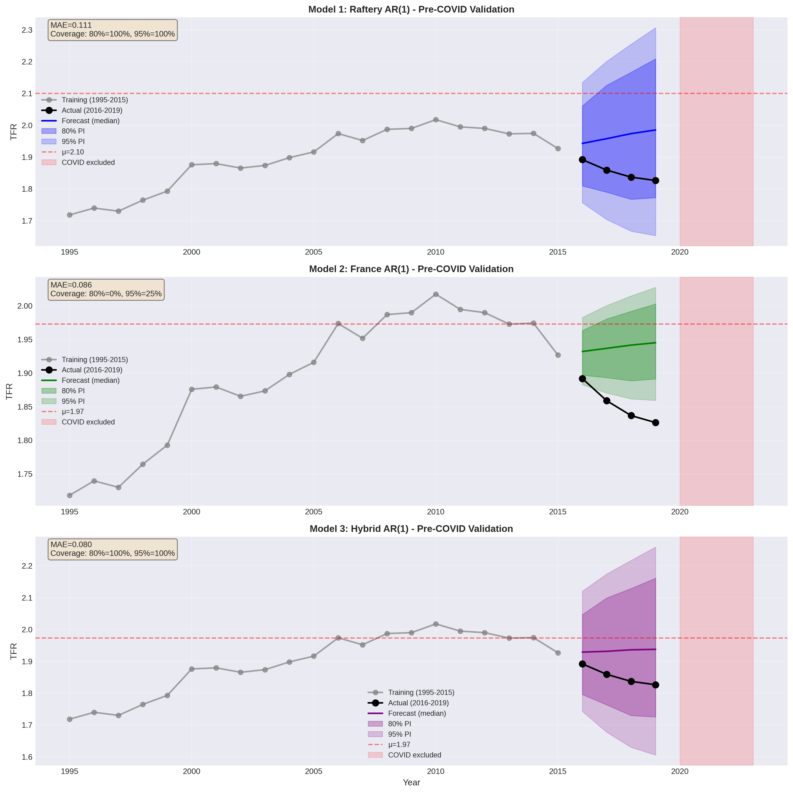

# Probabilistic Fertility Forecasting for France (2024-2075)

> **Replicating UN demographic methodology using autoregressive time series models**

[](https://www.python.org/)
[](https://opensource.org/licenses/MIT)

## Project Overview

Will France's fertility rate recover to replacement level (2.1 children/woman) or continue declining? This project forecasts France's Total Fertility Rate through 2075 using probabilistic AR(1) models, replicating methodology from Raftery et al. (2014) adopted by the UN for official population projections.

**Key Finding:** France likely stabilizes around **1.72** (below replacement), not 2.1 as global models assume.


*France TFR forecast: Hybrid model vs Raftery benchmark (2024-2075)*

---

## Quick Start
```bash
# Clone repository
git clone https://github.com/wengchienwei/demographic-fertility-forecasting-ar1.git
cd demographic-fertility-forecasting-ar1

# Install dependencies
pip install -r requirements.txt

# Download UN data (see Data Sources section)

# Run notebook
jupyter notebook france_tfr_forecasting.ipynb
```

---

## Technical Highlights

### What I built
- **Custom Monte Carlo simulator** for AR(1) forecasting (1000 trajectories)
- **Hybrid modeling approach** combining local and global parameters
- **Validation pipeline** with pre-COVID backtesting (2016-2019)
- **Comprehensive diagnostics** (residual analysis, stationarity tests, AIC/BIC comparison)

### Models Developed

| Model | μ (equilibrium) | ρ (persistence) | σ (volatility) | Use Case |
|-------|----------------|-----------------|----------------|----------|
| **Raftery AR(1)** | 2.10 | 0.89 | 0.10 | Global benchmark (21 countries) |
| **France AR(1)** | 1.74 | 0.98 | 0.038 | Local data (poor calibration) |
| **Hybrid AR(1)** ⭐ | 1.74 | 0.89 | 0.10 | Best: France μ + Raftery ρ,σ |

**Why Hybrid Wins:** Accurate point forecast + well-calibrated prediction intervals (100% coverage on validation)

---

## Key Results

### 1. Model Comparison
- **Raftery:** Predicts 2.08 in 2075 (optimistic - assumes recovery to replacement)
- **Hybrid:** Predicts 1.72 in 2075 (realistic - France stabilizes below replacement)
- **Gap grows over time:** 0.20 (2030) → 0.36 (2075)

### 2. Benchmark vs UN WPP2024
- Hybrid is **+0.065 more optimistic** than UN (1.72 vs 1.65 in 2075)
- UN prediction intervals widen over time (0.55→0.72), while Hybrid stays constant (~0.54)
- UN accounts for increasing long-term uncertainty

### 3. Model Validation
- Pre-COVID test (2016-2019): Hybrid achieves 100% calibration (80%, 95% PI)
- France-only model: 0% calibration (σ too small - overconfident)



---

## Methodology

### **1. Phase III Identification**
- Used Raftery's definition: Two consecutive 5-year increases below TFR < 2.0
- France Phase III: **1995-2023** (29 years post-transition)
- Stationarity confirmed: KPSS passes, ADF borderline (ρ ≈ 0.9)

### **2. Model Selection**
- Tested AR(1), AR(2), AR(3), ARMA(1,1)
- **ARMA(1,1) rejected:** Best AIC/BIC but predicted μ=32 (unrealistic)
- **AR(1) chosen:** Simple, stable, interpretable

### **3. Forecasting**
```
TFR_t = μ + ρ(TFR_{t-1} - μ) + ε_t,  where ε_t ~ N(0, σ²)
```
- Monte Carlo simulation: 1000 trajectories × 52 years
- Prediction intervals: 10th/90th percentile (80%), 2.5th/97.5th (95%)

---

## Skills Developed

**Time Series Analysis:**
- Stationarity testing (ADF, KPSS)
- ACF/PACF interpretation
- AR model fitting & diagnostics
- Residual analysis (normality, homoskedasticity)

**Statistical Modeling:**
- Maximum Likelihood Estimation (OLS)
- Model selection (AIC/BIC, out-of-sample validation)
- Prediction interval construction
- Calibration assessment

**Programming:**
- Custom Monte Carlo implementation
- Data wrangling (UN datasets)
- Reproducible research (Jupyter notebooks)
- Visualization (matplotlib, comparison plots)

**Critical Thinking:**
- Model validation strategy
- Limitation analysis (structural breaks, COVID)
- Benchmark comparison (UN projections)
- Hybrid approach innovation

---

## Repository Structure
```
├── france_tfr_forecasting.ipynb    # Main analysis notebook
├── requirements.txt                # Python dependencies
├── plots/                          # Generated visualizations
│   ├── final_forecast_comparison.png
│   ├── validation_precovid.png
│   └── diagnostics.png
└── README.md                       # This file
```

---

## Data Sources

**UN World Population Prospects 2024:**
- [Medium Variant](https://population.un.org/wpp/downloads)
- [Other Variants (80/95 PI)](https://population.un.org/wpp/downloads)

**Note:** Data files not included due to size.

---

## Limitations & Future Work

**Current Limitations:**
- Short Phase III history (29 years → parameter uncertainty)
- Assumes no structural breaks (COVID showed this fails)
- Migration excluded (deterministic assumption)
- Constant variance (may underestimate long-term uncertainty)

**Potential Extensions:**
- [ ] Bayesian parameter estimation (hierarchical model)
- [ ] Time-varying volatility (heteroskedastic models)
- [ ] Multi-country comparison (Germany, Netherlands)
- [ ] Exogenous variables (policy, economy, culture)
- [ ] Migration uncertainty module

---

## References

Raftery, A. E., Alkema, L., & Gerland, P. (2014). Bayesian population projections for the United Nations. *Statistical Science*, 29(1), 58-68. [DOI: 10.1214/13-STS419](https://doi.org/10.1214/13-STS419)

United Nations, Department of Economic and Social Affairs, Population Division (2024). *World Population Prospects 2024*. [https://population.un.org/wpp/](https://population.un.org/wpp/)

---

## Author

**Chien-Wei WENG**  
MSc Data Sciences and Business Analytics  
CentraleSupélec × ESSEC Business School  

[LinkedIn](https://www.linkedin.com/in/chien-wei-weng-74a6881b8/) 

---

## License

This project is licensed under the MIT License - see the [LICENSE](LICENSE) file for details.

---

*Academic Project | Forecasting and Predictive Analytics (Fall 2025)*  
*Instructor: Prof. Mikołaj Kasprzak (ESSEC Business School)*

---
